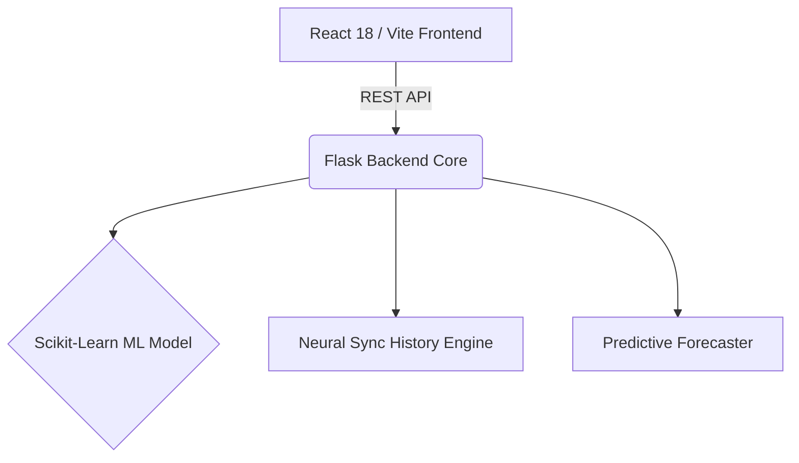

<div align="center">
  
  <h1>MEMEX — The Neural Financial Core</h1>
  <p><strong>Awwwards-Level Financial Intelligence & Predictive Orchestration</strong></p>
  
  [](#)
  [](#)
  [](#)
  [](#)
</div>

<br />

## 🪐 The System

Memex is not just an expense tracker. It is a fully decoupled **MERN-style** full-stack intelligence engine that tracks, predicts, and orchestrates your capital deployment using machine learning and deep historical analysis.

### ✨ Core Capabilities

- **Neural Sync (Mock Integration):** Simulates connecting to UPI/Banking apps like Paytm and PhonePe to instantly decrypt and analyze 6 months of historical ledgers.
- **Deep Archive Dashboard:** A cinematic, glassmorphic UI powered by Framer Motion and Recharts that breaks down capital outflows and identifies your financial archetype.
- **Predictive Wealth Forecasting:** Projects your net worth 5 years into the future, comparing the "Status Quo" to a "Memex Optimized" timeline based on dynamic compound interest mathematics.
- **Vampire Expense Radar:** Automatically scans for and identifies hidden recurring subscriptions, allowing you to mock-sever them with a single click.
- **Floating AI Co-Pilot:** A simulated, highly intelligent conversational agent that knows your 6-month history. Ask it: *"Can I afford a PS5?"* and watch it calculate your liquidity in real-time.

---

## 🛠 Architecture



## 🚀 Quick Start

### 1. Ignite the Backend Core
```bash
cd memex-
source .venv/bin/activate
python app.py
```
*(Runs the Flask inference server on port 8000)*

### 2. Launch the Cinematic Frontend
```bash
cd frontend
npm install
npm run dev
```
*(Runs the Vite application on port 5173)*

### 3. Generate ML Models (Optional)
If you need to retrain the risk classification models:
```bash
python train_model.py
```

---
<div align="center">
  <p>Engineered with precision. Designed for the future.</p>
</div>
